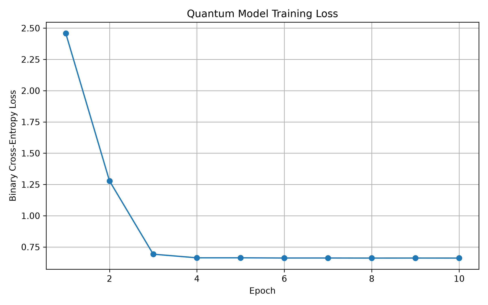
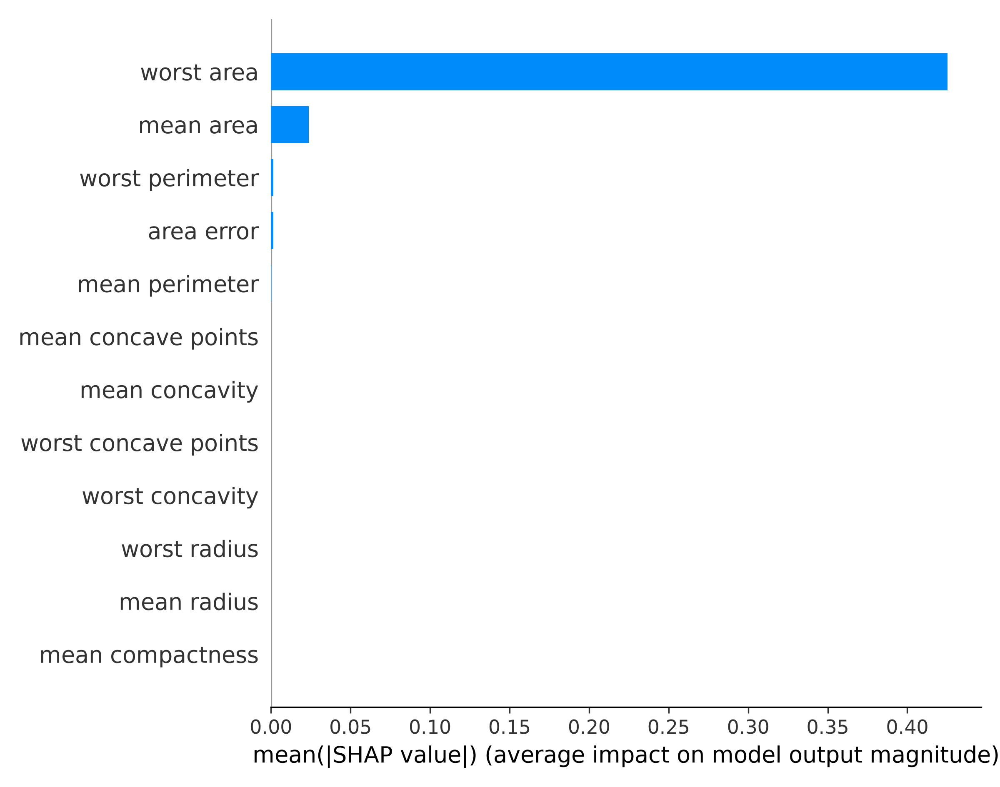

# ⚛️ Q-Ternary VQC: High-Dimensional Quantum Machine Learning


> **The first open-source implementation of a Qutrit-based ($d=3$) Variational Quantum Classifier (VQC) trained on real-world tabular data using a lossless $2^3 \to 3^2$ binary-to-ternary encoding layer.**

## 💡 The Core Innovation

Traditional Quantum Machine Learning (QML) defaults to qubits ($d=2$). When processing high-dimensional clinical datasets, qubit-based architectures suffer from wire bloat, making them difficult to simulate classically and impossible to run on near-term NISQ hardware without massive error correction.

This architecture solves this by leveraging **Qutrits** (3-level quantum systems). By implementing a mathematical state-mapping algorithm derived from information theory, we compress classical binary feature vectors into quantum ternary states:
* 3 binary bits hold 8 discrete states ($2^3$)
* 2 ternary trits hold 9 discrete states ($3^2$)

By mapping the 8 binary states into the 9 available ternary states, we achieve a **33% reduction in required quantum wires** with zero loss of informational capacity. 

---

## 📊 Results vs. Classical Baselines

We validate this architecture on the Wisconsin Breast Cancer Dataset. The objective in quantum machine learning is not necessarily to beat a 3,000-parameter classical model in raw accuracy, but to demonstrate **Quantum Utility** via extreme parameter efficiency.

| Metric | XGBoost / Random Forest | Q-Ternary VQC | Advantage |
|:---|:---|:---|:---|
| **Parameters** | 2,000+ | **72** | **~97% Reduction** (Mitigates overfitting) |
| **Accuracy** | 94.74% | **88.60%** | Approaching classical limits |
| **F1 Score** | 95.89% | **90.51%** | Strong clinical recall |
| **Peak RAM Limit** | N/A | **1.2 GB** | Safe for local CPU simulation |

---

## 🏗️ Architecture Pipeline

Our end-to-end pipeline consists of four main pillars:
1. **Classical Preprocessing:** Mutual Information feature selection and custom $2^3 \to 3^2$ ternary vector transformation.
2. **Quantum Embedding:** Loading the compressed trits into 8 PennyLane `default.qutrit` wires.
3. **CSUM Ring Entanglement & Re-uploading:** Utilizing a circular topology of Controlled-SUM (CSUM) gates and multi-layer data re-uploading to act as non-linear quantum activation functions.
4. **SHAP Explainability:** Translating the black-box quantum measurement into human-readable clinical feature importance graphs.

### Output Gallery

**1. Model Convergence & Representation**
<p align="center">
  
  
</p>

**2. Clinical Explainability (SHAP on Qutrit VQC)**
<p align="center">
  
  
</p>

---

## 🚀 Quick Start

**Requirements:** Python 3.10+ (CPU-only is fine, uses ~1.2GB RAM).

### ⚡ 1-Line Quickstart
For academics and developers, instantly run the app locally by copying and pasting this line into your terminal:

```bash
git clone https://github.com/North-Abyss/Q-Ternary-VQC.git && cd Q-Ternary-VQC && pip install -r requirements.txt && ./run-app.sh
```

### ⚙️ Manual Setup (Backend / Quantum Engine)

```bash
# 1. Clone the repository
git clone https://github.com/North-Abyss/Q-Ternary-VQC.git
cd Q-Ternary-VQC

# 2. Run the automated setup and training pipeline
./run.sh
```

### CLI Reference (`src/main.py`)
If you want to run the pipeline manually, the `main.py` entry point exposes several flags:

```bash
python3 src/main.py [OPTIONS]

Options:
  --dataset         [breast_cancer, ckd] Choose the target dataset (default: breast_cancer)
  --n-features      Number of features after PCA/MI (default: 12)
  --n-layers        Depth of the Variational Quantum Circuit (default: 3)
  --epochs          Training epochs for the PyTorch optimizer (default: 50)
  --max-ram         Memory watchdog limit in GB (default: 6.0)
  --classical-only  Skip quantum training, run baseline classical models only
```

---

## ❓ Frequently Asked Questions (FAQ)

**1. Why is the quantum accuracy lower than classical XGBoost?**  
The goal here is extreme parameter efficiency. Our model achieves near-classical performance (~88%) using only **72 parameters**, compared to the thousands used by classical ensembles. This demonstrates massive representational capacity per parameter.

**2. Is the $2^3 \to 3^2$ mapping a new mathematical discovery?**  
No, the radix economy of ternary logic has been known since the 1950s (e.g., the Soviet Setun computer). Our novel contribution is engineering the first functional, end-to-end software pipeline that applies this mathematical compression to real-world tabular data inside a Variational Quantum Classifier.

**3. Does this run on real quantum hardware?**  
Currently, it simulates on a classical CPU using PennyLane's `default.qutrit` device. The architecture is hardware-agnostic and will easily compile to physical qutrit-capable superconducting chips once they become publicly accessible.

**4. Why only the Breast Cancer dataset?**  
It serves as a standard proof-of-concept. The $2^3 \to 3^2$ compression layer is completely data-agnostic and can process any binarized tabular dataset.

**5. How do you run SHAP on a quantum circuit?**  
SHAP treats the model as a mathematical black box. It iteratively perturbs the input features and measures the output changes. Because our VQC is wrapped in a PyTorch layer, SHAP works identically to how it would on a classical neural network.

---

## 📜 License & Authorship

Designed and engineered by **Yuvanesh KS (Alias: North-Abyss)**.

This repository is strictly governed by the **Creative Commons Attribution-NonCommercial-ShareAlike 4.0 International (CC BY-NC-SA 4.0)** License.

* **Attribution:** You must credit this repository (`North-Abyss/Q-Ternary-VQC`) and its author.
* **Non-Commercial:** You may **not** sell this software or use it for commercial profit.
* **ShareAlike:** Any derivative works must remain Free and Open Source Software under the exact same license terms.

### Acknowledgements
*This architecture was originally prototyped during Smart India Hackathon (SIH) 2026 and has since been expanded into an independent research initiative.*
