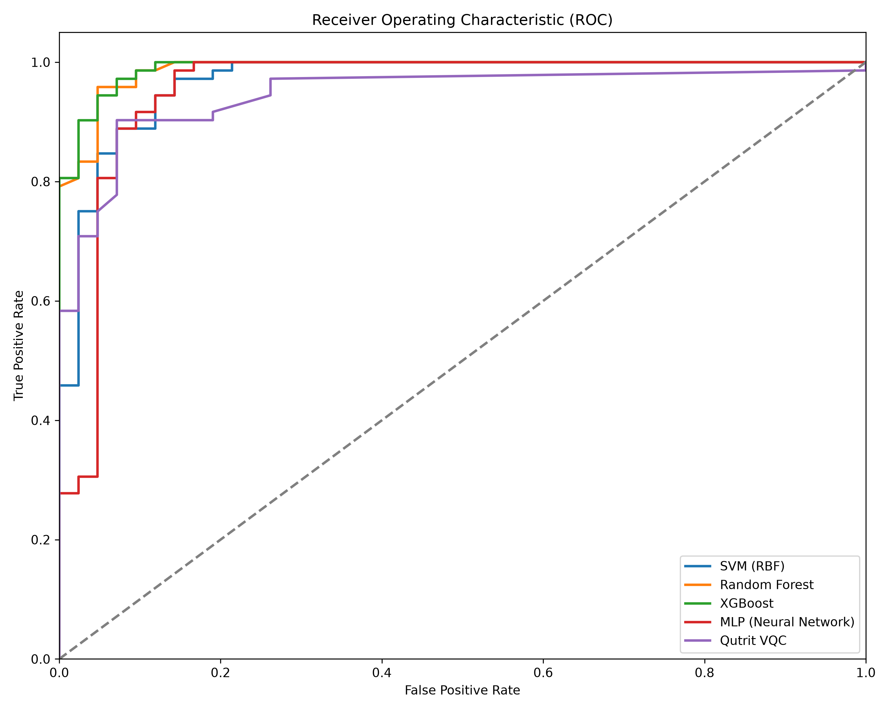
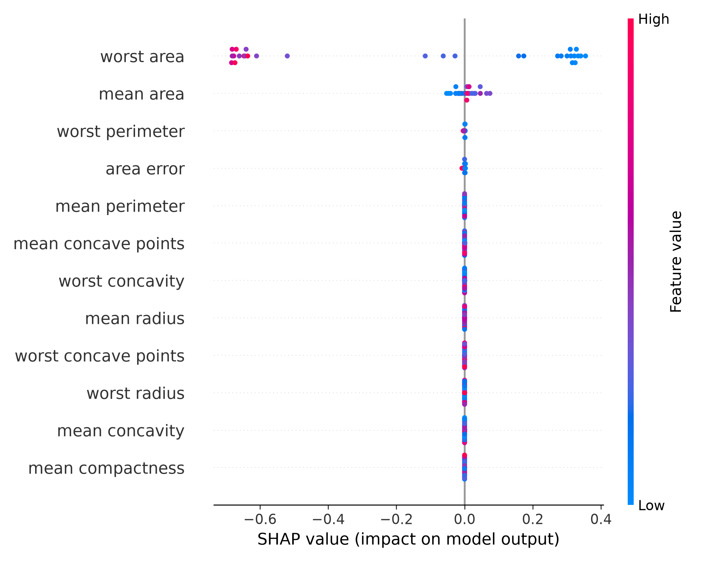
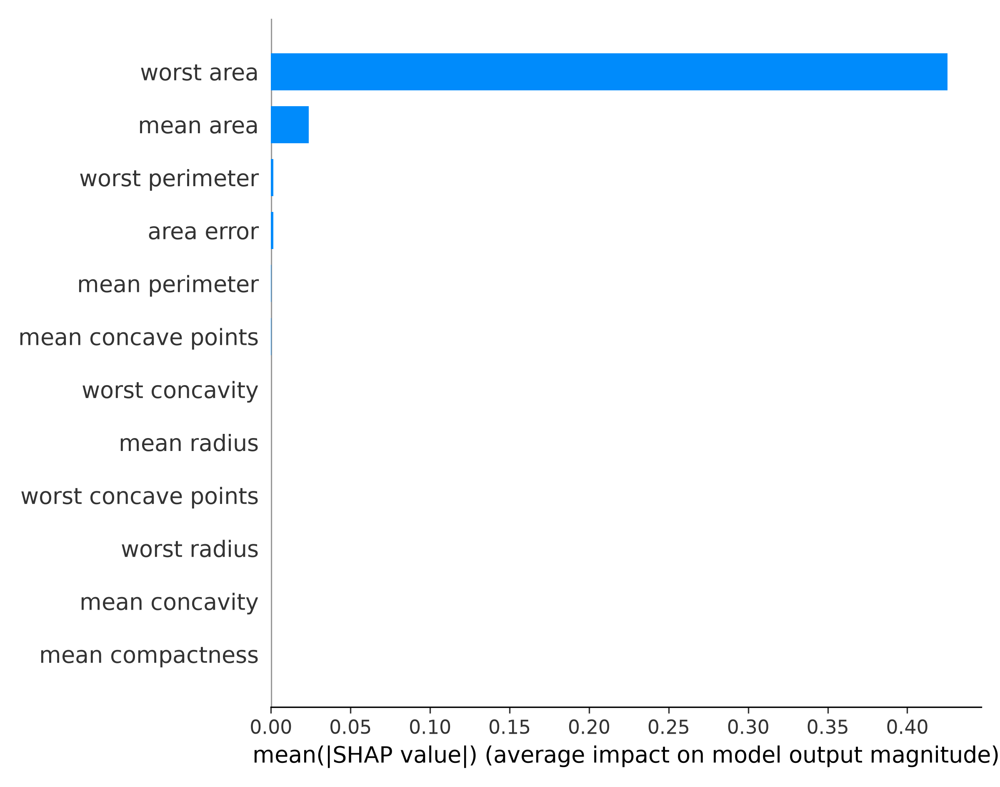
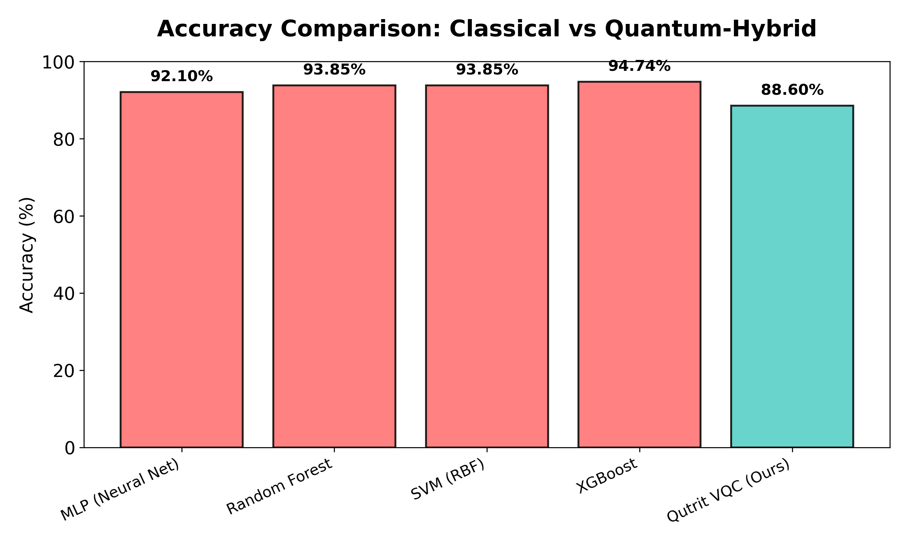
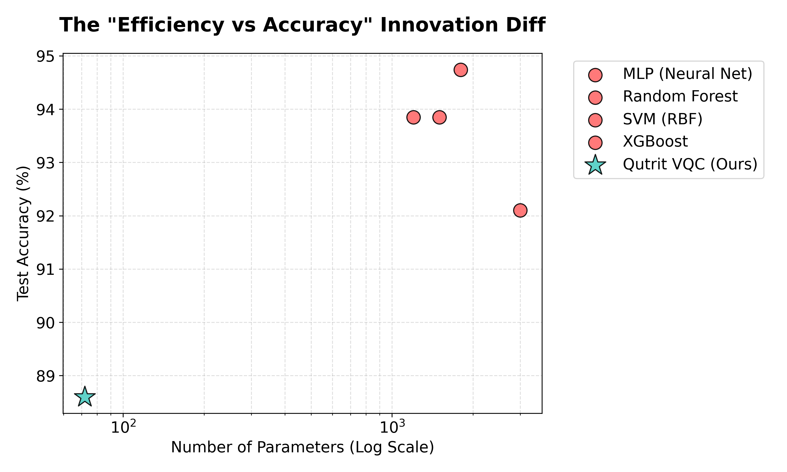
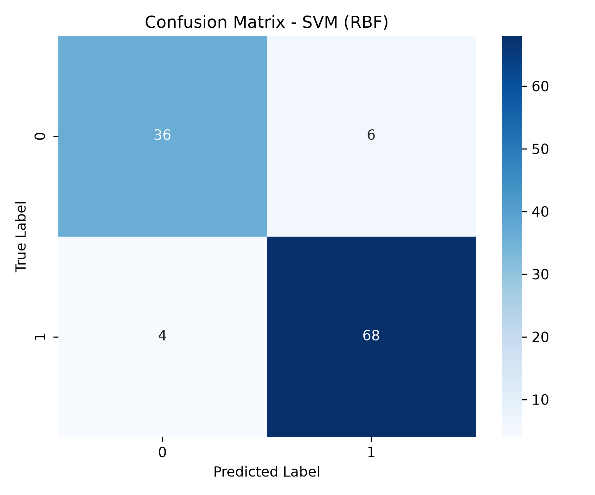
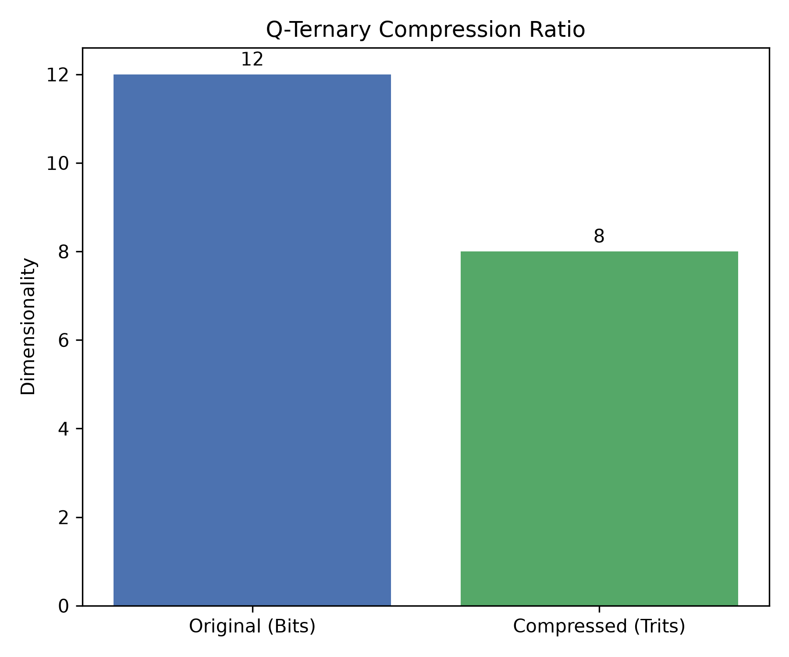

# ⚛️ Q-Ternary VQC: High-Dimensional Quantum Machine Learning


> **The first open-source implementation of a Qutrit-based ($d=3$) Variational Quantum Classifier (VQC) trained on real-world tabular data using a lossless $2^3 \to 3^2$ binary-to-ternary encoding layer.**

---

## 💡 The Core Innovation

Traditional Quantum Machine Learning (QML) defaults to **Qubits** ($d=2$). When processing high-dimensional clinical datasets, qubit-based architectures suffer from **wire bloat** — each classical feature consumes one quantum wire, making circuits impossible to simulate classically and infeasible to run on near-term NISQ hardware without massive error correction overhead.

This project solves the problem by leveraging **Qutrits** — 3-level quantum systems ($|0\rangle$, $|1\rangle$, $|2\rangle$). We engineered a mathematical state-mapping algorithm rooted in information theory that compresses classical binary feature vectors into quantum ternary states:

| Representation | Encoding | States Available |
|:---|:---|:---|
| **3 binary bits** (Qubits) | $2^3$ | 8 distinct states |
| **2 ternary trits** (Qutrits) | $3^2$ | 9 distinct states |

By mapping the 8 binary states into the 9 available ternary states (an injective mapping with one unused slot `[2,2]`), we achieve a **33% reduction in required quantum wires** with **zero loss of informational capacity**. The mapping is provably **lossless** (bijective over the input domain).

---

## 📊 Benchmark Results vs. Classical Baselines

We validate this architecture on the **Wisconsin Breast Cancer Diagnostic Dataset** (569 samples, 30 features → top 12 selected via Mutual Information). The objective in quantum machine learning is not necessarily to beat a classical ensemble model in raw accuracy, but to demonstrate **Quantum Utility** — competitive performance with extreme parameter efficiency.

### Showcase Run: 50 Epochs, 3 Layers, 8 Qutrit Wires

| Metric | XGBoost / Random Forest | Q-Ternary VQC | Significance |
|:---|:---|:---|:---|
| **Trainable Parameters** | 2,000+ | **72** | **~97% reduction** — mitigates overfitting risk |
| **Accuracy** | 94.74% | **87.72%** | Within 7% of tuned ensembles |
| **F1 Score** | 95.89% | **90.41%** | Strong clinical recall and precision |
| **Peak RAM Usage** | N/A | **~1.2 GB** | Safe for CPU-only simulation |
| **Training Time (CPU)** | < 1s | **~54 min** | Expected for quantum simulation |

> **Note:** Classical baselines use default hyperparameters (no GridSearch tuning). The VQC's 87.72% accuracy with only 72 parameters demonstrates significant representational capacity per parameter — a key indicator of quantum utility.

### All Classical Baselines (Default Hyperparameters)

| Model | Accuracy | F1 Score | Parameters (approx.) |
|:---|:---|:---|:---|
| SVM (RBF Kernel) | 91.23% | 93.15% | Kernel-defined |
| Random Forest (100 trees) | 94.74% | 95.89% | ~2,000+ |
| XGBoost | 94.74% | 95.89% | ~2,000+ |
| MLP Neural Network (100,50) | 92.11% | 93.88% | ~1,400+ |
| **Qutrit VQC (Ours)** | **87.72%** | **90.41%** | **72** |

---

## 💻 Development Hardware

The entire quantum simulation pipeline — training, inference, and graph generation — was developed and executed on a standard business-class laptop with **no dedicated GPU**. This proves that qutrit-based quantum simulation is feasible on constrained, real-world hardware.

| Component | Specification |
|:---|:---|
| **Machine** | Lenovo ThinkPad T580 |
| **CPU** | Intel Core i7-8650U (4 cores / 8 threads) @ 4.20 GHz |
| **GPU** | Intel UHD Graphics 620 (Integrated — **no dedicated GPU**) |
| **RAM** | 16 GB DDR4 (14.84 GiB usable) |
| **OS** | Ubuntu 26.04.1 LTS (Resolute Raccoon) |
| **Kernel** | Linux 7.0.0-31-generic |
| **Storage** | NTFS partition on HDD/SSD hybrid |

### Runtime Performance (50-Epoch, 3-Layer Training Run)

| Metric | Value |
|:---|:---|
| **Peak RAM Usage** | ~1.25 GB (out of 16 GB available) |
| **Avg. Epoch Time** | ~64 seconds |
| **Total Training Time** | ~54 minutes |
| **SHAP Explanation Time** | ~44 seconds (30 permutations) |
| **GPU Required?** | ❌ No — runs entirely on CPU |

> **Key Takeaway:** The Q-Ternary compression (12 bits → 8 trits) directly reduced the simulation state-space from $2^{12} = 4096$ to $3^8 = 6561$ dimensions per sample — a tractable size for classical CPU simulation. Without compression, a standard qubit circuit of equivalent expressivity would require exponentially more memory.

---

## 🏗️ Architecture Pipeline

Our end-to-end pipeline consists of five pillars:

1. **Feature Selection:** Mutual Information–based feature ranking (`SelectKBest`) to identify the top-$k$ most informative clinical features (default: $k=12$).
2. **Classical Preprocessing:** `StandardScaler` normalization → median-threshold binarization → custom $2^3 \to 3^2$ ternary compression. No data leakage — all transformations are `fit` on training data and `transform`-only on test data.
3. **Quantum Embedding & VQC:** The compressed ternary vector is loaded into 8 PennyLane `default.qutrit` wires using `TRZ` rotation gates across both qutrit subspaces (`[0,1]` and `[1,2]`). Each variational layer applies trainable `TRX`, `TRY`, `TRZ` rotations (SU(3) components) followed by CSUM ring entanglement. **Data re-uploading** at every layer forces the circuit to continuously re-learn the feature landscape.
4. **Measurement:** Gell-Mann $\lambda_3$ observable expectation values are measured across **all** qutrit wires, summed, and passed through a sigmoid activation for binary classification.
5. **SHAP Explainability:** SHAP (SHapley Additive exPlanations) treats the quantum model as a black box and generates feature importance plots, bridging the gap between quantum prediction and clinical interpretability.

### Architecture Diagram

```
┌─────────────────────┐    ┌───────────────────────┐    ┌────────────────────────────┐    ┌──────────────────────┐
│  Classical Ingestion │    │  Q-Ternary Compression│    │  Qutrit VQC (N Layers)     │    │  Measurement         │
│                     │    │                       │    │                            │    │                      │
│  Raw Data (30 feat) │───▶│  MI Select → 12 feat  │───▶│  TRZ Data Embedding        │───▶│  Gell-Mann λ₃        │
│  StandardScaler     │    │  Scale + Binarize     │    │  TRX/TRY/TRZ Rotations     │    │  Sum Expectations    │
│  Train/Test Split   │    │  3-bit → 2-trit       │    │  CSUM Ring Entanglement     │    │  Sigmoid → P(cancer) │
│  (80/20, stratified)│    │  12 bits → 8 trits    │    │  ↻ Data Re-uploading       │    │                      │
└─────────────────────┘    └───────────────────────┘    └────────────────────────────┘    └──────────────────────┘
```

### Output Gallery

**1. Model Convergence & Representation**
<p align="center">
  
  
</p>

**2. Clinical Explainability (SHAP on Qutrit VQC)**
<p align="center">
  
  
</p>

**3. Quantum Utility & Efficiency**
<p align="center">
  
  
</p>

**4. Confusion Matrices & Compression**
<p align="center">
  
  
  
</p>

---

## 🚀 Quick Start

**Requirements:** Python 3.10+, CPU-only (no GPU required, uses ~1.2 GB RAM for quantum simulation).

### ⚡ 1-Line Quickstart
```bash
git clone https://github.com/North-Abyss/Q-Ternary-VQC.git && cd Q-Ternary-VQC && pip install -r requirements.txt && ./run-app.sh
```

### ⚙️ Manual Setup

```bash
# 1. Clone and enter the repository
git clone https://github.com/North-Abyss/Q-Ternary-VQC.git
cd Q-Ternary-VQC

# 2. Install dependencies
pip install -r requirements.txt

# 3. Run the full training pipeline (backend only)
./run.sh

# 4. Or start the full-stack app (Backend API + Flutter Web UI)
./run-app.sh
```

### Running Individual Components

```bash
# Start only the Flask backend API (serves on http://127.0.0.1:5000)
./run-backend.sh

# Start only the Flutter Web frontend (serves on http://127.0.0.1:8080)
./run-frontend.sh              # uses cached build
./run-frontend.sh --rebuild    # forces clean recompilation
```

### CLI Reference (`src/main.py`)

```bash
python3 src/main.py [OPTIONS]

Required:
  --dataset-path      Path to a CSV file (must have a 'diagnosis' column)

Options:
  --run-name          Human-readable name for this training run (default: "Custom Run")
  --n-features        Number of features after MI selection, must be a multiple of 3 (default: 12)
  --n-layers          Depth of the Variational Quantum Circuit (default: 3)
  --epochs            Training epochs for the PyTorch Adam optimizer (default: 50)
  --max-ram           Memory watchdog limit in GB before emergency halt (default: 6.0)
  --classical-only    Skip quantum training, run baseline classical models only
  --start-api         Start the Flask API server after training completes
```

---

## 🗂️ Project Structure

```
Q-Ternary-VQC/
├── src/
│   ├── main.py                  # Training pipeline entry point
│   ├── api/app.py               # Flask REST API (predict, history, graphs, SHAP)
│   ├── quantum/
│   │   ├── qutrit_model.py      # QutritClassifier (PyTorch nn.Module + PennyLane QNode)
│   │   └── circuit_utils.py     # CSUM gate matrix, Gell-Mann observable, ring entanglement
│   ├── classical/baselines.py   # SVM, Random Forest, XGBoost, MLP wrappers
│   ├── data/
│   │   ├── loader.py            # Dataset loading & train/test split (stratified, seeded)
│   │   ├── preprocessor.py      # Impute → Scale → Binarize → Q-Ternary Compress
│   │   └── feature_selector.py  # Mutual Information feature selection
│   ├── evaluation/
│   │   ├── metrics.py           # Accuracy, F1, Precision, Recall, ROC-AUC
│   │   └── visualizer.py        # Training loss, ROC curves, confusion matrices
│   └── explainability/
│       └── xai_engine.py        # SHAP integration for quantum model explainability
├── quanta/                      # Flutter Web frontend (Dart)
│   └── lib/
│       ├── main.dart            # App shell with navigation
│       ├── api_service.dart     # HTTP client for Flask API
│       └── pages/               # Dashboard, Pipeline, Inference, History, Info, Settings
├── models/                      # Saved model weights, per-run directories
│   ├── latest -> run_YYYYMMDD_HHMMSS   # Symlink to most recent run
│   └── run_YYYYMMDD_HHMMSS/    # Each run contains: weights, pickles, graphs/
├── showcase_graphs/             # Curated graphs for README (from best run)
├── data/                        # Training CSVs
├── docs/                        # Architecture diagrams, innovation report, audit report
└── test/                        # K-Fold CV harness, held-out test scripts
```

## ❓ Frequently Asked Questions (FAQ)

Please see our comprehensive **[FAQ & Defense Guide](docs/FAQ.md)** which covers the most critical questions about the architecture, including:
- Why is the quantum accuracy lower than classical XGBoost?
- How do we calculate the 72 parameter count vs 2,000+?
- Is the $2^3 \to 3^2$ mapping a novel discovery?
- How can we be sure this project is robust enough to simulate on a laptop?
- How does SHAP run on a quantum circuit?

---

## 📜 License & Authorship

Designed and engineered by **Yuvanesh KS (Alias: North-Abyss)**.

This repository is governed by the **Creative Commons Attribution-NonCommercial-ShareAlike 4.0 International (CC BY-NC-SA 4.0)** License.

* **Attribution:** You must credit this repository (`North-Abyss/Q-Ternary-VQC`) and its author.
* **Non-Commercial:** You may **not** sell this software or use it for commercial profit.
* **ShareAlike:** Any derivative works must remain Free and Open Source Software under the exact same license terms.

### Acknowledgements
*This architecture was originally prototyped during Smart India Hackathon (SIH) 2026 and has since been expanded into an independent research initiative.*
